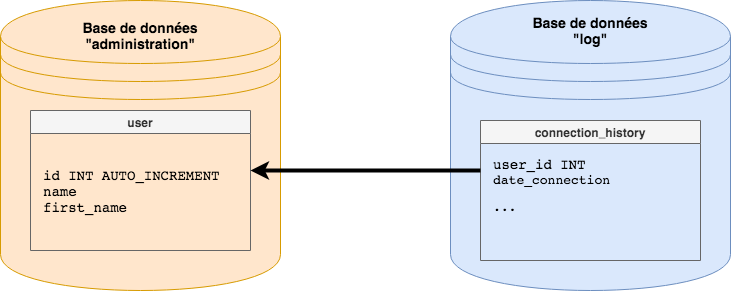

Il est assez commun lorsque l'on fait des tables MySQL d'utiliser comme clé primaire un id autoincrement.

```SQL
CREATE TABLE user (
  id INT AUTO_INCREMENT,
  name VARCHAR(255) NOT NULL,
  first_name VARCHAR(255) NOT NULL,
  PRIMARY KEY (id)
) ENGINE=INNODB;
```

Hormis le fait qu'il y a pas mal de discussions autour de cette pratique, l'utilisation de l'autoincrement d'une entité peut-être problèmatique si on veut la référencer dans une autre base de données.



Je me suis aperçu que MySQL avait un comportement particulier avec ces autoincrements sur des tables InnoDB. **Lors du redémarrage du service MySQL, il va recalculer pour toutes les tables la valeur suivante de l'autoincrement.**

Extrait de la documentation :

> In MySQL 5.7 and earlier, the auto-increment counter is stored only in main memory, not on disk. To initialize an auto-increment counter after a server restart, InnoDB would execute the equivalent of the following statement on the first insert into a table containing an AUTO_INCREMENT column : SELECT MAX(ai_col) FROM table_name FOR UPDATE;

Ce comportement est valable pour les versions de MySQL <= 5.7. Pour la version 8, le fonctionnement est modifié mais n'est pas fiable à 100%.

# Exemple
Pour mieux comprendre, je vais reproduire ce comportement en se basant sur la table décrite ci-dessus.

1. Insertion de deux utilisateurs 
```SQL
INSERT INTO user VALUES (NULL, 'john', 'doe');
INSERT INTO user VALUES (NULL, 'jane', 'doe');
SELECT * FROM user;
```
```SQL
+----+------+------------+
| id | name | first_name |
+----+------+------------+
|  1 | john | doe        |
|  2 | jane | doe        |
+----+------+------------+
```

2. Suppression du dernier utilisateur inséré et ajout d'un nouveau
```SQL
DELETE FROM user WHERE id = 2;
INSERT INTO user VALUES (NULL, 'bob', 'doe');
SELECT * FROM user;
```
```SQL
+----+------+------------+
| id | name | first_name |
+----+------+------------+
|  1 | john | doe        |
|  3 | bob  | doe        |
+----+------+------------+
```

MySQL n'a pas réutilisé l'id 2 qui était utilisé par l'utilisatrice `jane doe

3. On supprime le dernier utilisateur créé
```SQL
DELETE FROM user WHERE id = 3;
SHOW CREATE TABLE user;
```
```SQL
| user  | CREATE TABLE `user` (
  `id` int(11) NOT NULL AUTO_INCREMENT,
  `name` varchar(255) NOT NULL,
  `first_name` varchar(255) NOT NULL,
  PRIMARY KEY (`id`)
) ENGINE=InnoDB AUTO_INCREMENT=4 DEFAULT CHARSET=latin1
```

On voit ici que le prochain autoincrement utilisé sera le 4 (`AUTO_INCREMENT=4)

4. On rédémarre mysql
```bash
service mysql restart
```

5. On vérifie la valeur de notre prochain autoincrement
```SQL
SHOW CREATE TABLE user;
```
```SQL
| user  | CREATE TABLE `user` (
  `id` int(11) NOT NULL AUTO_INCREMENT,
  `name` varchar(255) NOT NULL,
  `first_name` varchar(255) NOT NULL,
  PRIMARY KEY (`id`)
) ENGINE=InnoDB AUTO_INCREMENT=2 DEFAULT CHARSET=latin1
```

MySQL a recalculé la valeur du prochain autoincrement disponible (`AUTO_INCREMENT=2`). La prochaine entrée aura donc comme id la valeur 2. Dans le cas décrit sur le schéma, **on pourrait se retrouver avec un historique de données d'un utilisateur qui ne le concerne pas.**

# Que faut-il donc faire si l'on souhaite garder l'autoincrement ?
* N'utiliser la valeur de l'autoincrement **que dans la base de données où il a été généré** (clé étrangère par exemple).
* Trouver un autre moyen de reférencer vos entités de manière unique pour les autres bases de données : **utiliser un UUID** par exemple
```SQL
CREATE TABLE user (
  id INT AUTO_INCREMENT,
  uuid varchar(36) NOT NULL,
  name VARCHAR(255) NOT NULL,
  first_name VARCHAR(255) NOT NULL,
  PRIMARY KEY (id)
) ENGINE=INNODB;
```
On référencera donc dans la base `log` du schéma l'utilisateur par son attribut `uuid` au lieu de `id`
```mysql
CREATE TABLE connection_history (
  user_uuid varchar(36) NOT NULL,
  ...
)
```

Vous pouvez utiliser en PHP la librairie **ramsey/uuid** afin de générer cet UUID avant l'insertion en base de données.

---

# Ressources

* [UUID vs autoincrement](https://lmgtfy.com/?q=uuid+vs+autoincrement)
* [Générer des UUID en PHP avec ramsey/uuid](https://github.com/ramsey/uuid)
* [Documentation de MySQL sur les autoincrement](https://dev.mysql.com/doc/refman/8.0/en/innodb-auto-increment-handling.html)


